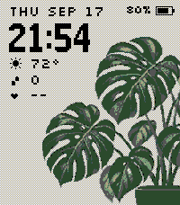

# Monstera — Pebble Time 2

A botanical watchface for the 200 × 228 Pebble Time 2 display, pairing bold pixel numerals with forest-green monstera leaves and a muted gray-ivory background.



## Install

Download [Monstera Watchface.pbw](Monstera%20Watchface.pbw) and sideload it through the Pebble mobile app, or install using the phone IP shown by the app:

```sh
pebble install --phone YOUR_PHONE_IP "Monstera Watchface.pbw"
```

## Features

- Live time using the watch's 12/24-hour preference, weekday, and date.
- Battery gauge, percentage, and charging indicator.
- Daily steps and the latest available heart-rate reading from Pebble Health. Missing readings appear as dashes; heart rate requires supported hardware and available Health data.
- Current temperature in Fahrenheit or Celsius and sun/cloud/rain icon, supplied by [Open-Meteo](https://open-meteo.com/). Weather refreshes every 30 minutes through the phone, requires location permission and internet, and disappears after two hours without a successful update.
- Clock, artwork, battery, and available health readings work offline. No API key or separate companion app is required.

## Build and validate

```sh
npm ci
pebble build
pebble install --emulator emery
node tests/weather.js
```

Build output: `build/Monstera Watchface.pbw`. The root PBW is the current packaged version, 1.4.0.

Built with Pebble SDK 4.9.148. Installed and visually checked in the Time 2 emulator. Weather tests cover valid and malformed responses, duplicate suppression, HTTP errors, timeouts, and location failure recovery. Prior emulator checks covered 12/24-hour layouts, full/low battery, charging, live weather, and unavailable health readings. Physical-device heart-rate sensing has not been tested.

## Design and attribution

The original plant artwork was generated with the built-in imagegen tool from the supplied visual reference. Its source and prompt are retained in `artwork/monstera-source.png` and `artwork/prompt.txt`. The alternative smaller composition is retained separately as a design iteration.

`resources/images/background.png` is the production asset. The watchface displays it at 90% size, anchored bottom-right, with native nearest-neighbor scaling applied once at startup. A fine blend of native light gray, pale yellow, and white approximates gray-ivory on the display's 64-color palette. Its nominal average is approximately #D5D5BF; appearance varies with the screen and lighting.

Clock numerals are original 9 × 16 pixel glyphs rendered at 2× scale. Data labels use [Silkscreen](https://github.com/googlefonts/silkscreen), by Jason Kottke / The Silkscreen Project Authors, under the SIL Open Font License. The license is included in `resources/fonts/OFL-Silkscreen.txt`.

## App store resources

The [store upload kit](Monstera%20Store%20Kit.zip) contains the release binary, paste-ready description, listing details, a native screenshot, 720 × 320 marketing banner, and 144 px / 80 px icons. See [upload instructions](store-assets/README.md). Promotional artwork masters and imagegen prompts are in `artwork/store/`. The store listing has not been published.

## Settings

Open Monstera’s settings in the Pebble mobile app to choose Fahrenheit or Celsius and independently show or hide weather, steps, battery (icon and percentage together), and heart rate. Settings persist across restarts. All indicators are enabled and Fahrenheit is selected by default. Hiding weather stops weather requests. Battery percentage appears to the left of its icon.
